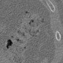
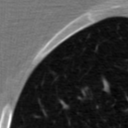
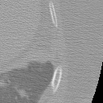

# Lung Nodule Detection
Using a 3D Vision Transformer (ViT) to detect lung nodules from CT images. Given a patch of CT image, the model has to classify if there is a nodule present in the image, as well as its location if any. The exmaple images below show patches from [Luna16](https://luna16.grand-challenge.org/Home/), each with an annotated nodule highlighted in a 3D bounding box that the model needs to predict.

## Devlog
**4.11** - Added 3D ResNet backbone as feature extractor for transformer, might help increase representation capability.

## Todo
- test iou score is unacceptably low, maybe try generalized iou as objective.
- dataloader is even slower than a backprop cycle, need optimization.
