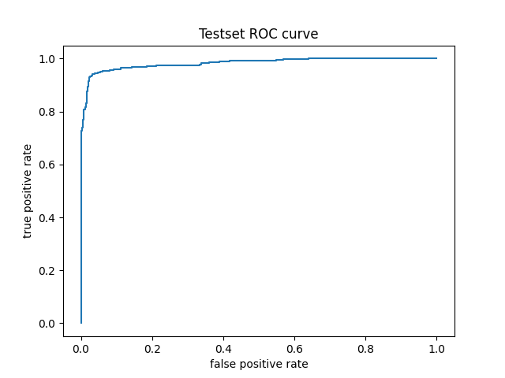
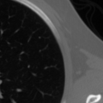
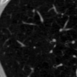
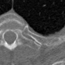
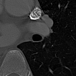

# Lung Nodule Detection
Using a 3D Vision Transformer (ViT) to detect lung nodules from CT images through end-to-end training. The model is trained on [Luna16](https://luna16.grand-challenge.org/Home/) dataset consisting of 888 CT scans. A typical data point is shown below.


## Data processing
The data is already stored in metaImage format and can be loaded and processed at runtime. Use `dataset.preprocess()` to convert raw files to npy files for faster loading.
The preprocessing procedure is simple: the images are randomly cropped into patches of size [40,128,128], normalized and randomly flipped. The dataset is split into 10 subsets and 1 of them is held out for testing.

## Training
Configure the model with `model_config.json`, and training settings are in `train.py`. Then simply run
```
python train.py
```

## Results
The model is trained for 100k steps using the settings in `model_config.json` and `train.py`. The final training loss is 0.0478, test f1 score=0.882, test iuo=0.268, and test auc=0.982. The testset ROC is shown below.



A curated set of bounding box predictions is shown below, along with their ground truth for comparison. The model struggles to precisely bound the nodule especially when it is close to the pleura or of small size. Nevertheless, it roughly indicates where one should look for it.

Predicted Bounding Boxes: 



Ground Truth Bounding Boxes:


See [`eval.ipynb`](./eval.ipynb) for details. This checkpoint is available for download [here](https://huggingface.co/rlsn/DeTr4LungNodule)
